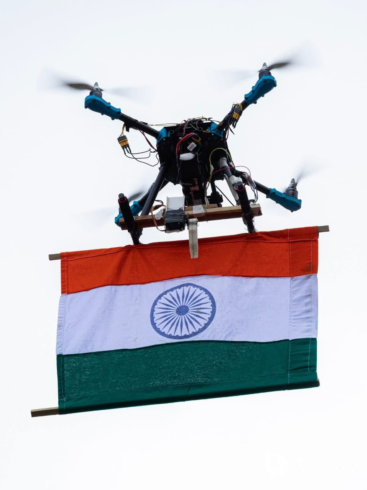
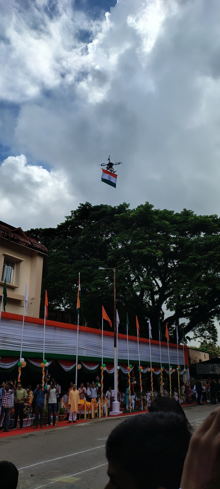
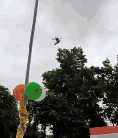
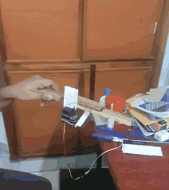
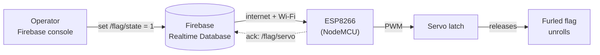
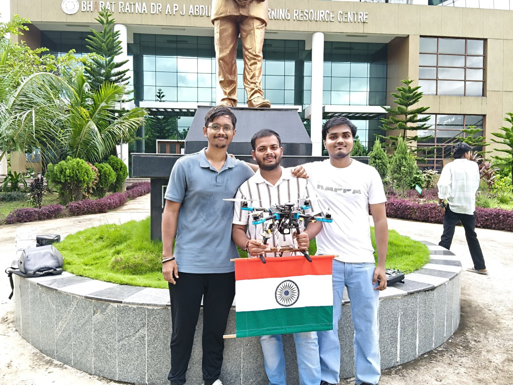
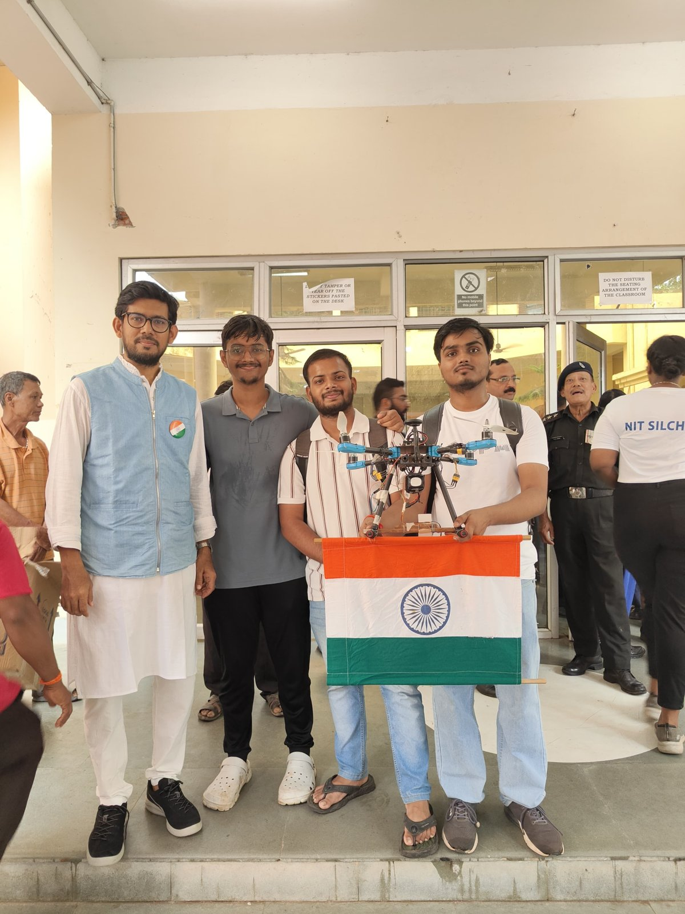

# Drone-based Flag Hoisting System

A quadcopter carried a furled national flag from the campus library at **NIT Silchar** to the **Independence Day 2025** celebration and unfurled it over the crowd on command. The release is a servo latch driven by an **ESP8266** that reads a single value from **Firebase Realtime Database** over Wi-Fi: `0` keeps the flag locked, `1` releases it.

<p align="center">
  
  &nbsp;
  
</p>

## Demo

| Independence Day flight | Night release rehearsal | Release mechanism on the bench |
|:---:|:---:|:---:|
|  |  |  |
| [Full video](media/videos/04_independence_day_flight.mp4) | [Full video](media/videos/03_night_release_rehearsal.mp4) | [Full video](media/videos/01_release_mechanism_bench_test.mp4) |

Also: [night test flight with the release rig fitted](media/videos/02_night_test_flight.mp4).

## What it did

On 15 August 2025 the drone took off from the campus library (Bharat Ratna Dr APJ Abdul Kalam Learning Resource Centre) carrying the flag rolled up and locked under its frame. It flew autonomously to the New Gallery building area, where the Independence Day celebration was being held. Over the venue, the release value in Firebase was switched from `0` to `1`, the servo opened the latch, and the flag unrolled and hung below the drone for the flyover.

Before the event, the team bench-tested the latch and rehearsed the full carry-and-release sequence at night over a football ground.

## How it works



| `/flag/state` | Latch | Flag |
|:---:|---|---|
| `0` | Closed | Held rolled up under the drone |
| `1` | Open | Released; unrolls under its own weight |

- The release runs on its **own ESP8266** and is triggered from Firebase, separate from the drone's flight controller. The ESP8266 only moves the latch.
- The operator switches the value by hand in the Firebase console, so no custom app is needed.
- The board **boots closed** and only opens on an explicit `1`. Network errors, Wi-Fi loss or unexpected values never open the latch.

## Hardware

| Part | Role |
|---|---|
| Quadcopter | Carries the payload; flown autonomously from the library to the venue |
| ESP8266 (NodeMCU) | Connects to Wi-Fi, reads the Firebase value, drives the servo |
| Hobby servo | Moves the latch that holds the rolled flag |
| Wooden rods and latch arm | Frame for the flag and the release mechanism, mounted under the drone |
| National flag on a rod | Rolled up for the flight, unrolls on release |

### Wiring for the firmware in this repo

| Servo wire | Connects to |
|---|---|
| Signal (orange/yellow) | NodeMCU **D5** (GPIO14) |
| +V (red) | 5 V supply (BEC). Do not power the servo from the NodeMCU's 3.3 V pin |
| GND (brown/black) | Supply ground, shared with NodeMCU GND |

## Firmware

[`firmware/flag_release/flag_release.ino`](firmware/flag_release/flag_release.ino)

> **Note:** the original 2025 sketch was not kept. This firmware is a clean rebuild of the same design: ESP8266, Firebase Realtime Database over Wi-Fi, one servo, `0` = closed and `1` = open. Compile it and bench-test the latch before any flight.

1. Install the **ESP8266 board package** and the **Firebase Arduino Client Library for ESP8266 and ESP32** (by Mobizt) in the Arduino IDE.
2. In Firebase, create a Realtime Database and add the key `flag/state` with the value `0`.
3. Copy `secrets.example.h` to `secrets.h` and fill in your Wi-Fi name and password, database URL and database secret.
4. Set `ANGLE_CLOSED` and `ANGLE_OPEN` to suit your latch, then upload to a NodeMCU board.
5. On the bench: load the latch, set `flag/state` to `1` in the console, and check that it releases and that `flag/servo` changes to `1`. Set it back to `0` to re-arm.

The ESP8266 needs a Wi-Fi network with internet access that covers the whole flight path. That coverage is the main limit on range.

## Team

| Person | Role |
|---|---|
| **Jay Vishwakarma** | Electronics and flag-hoisting (release) mechanism: ESP8266, servo latch, Firebase control |
| **Aditya Sah** | Autonomous flight of the drone from the library to the venue |
| **Ayush Shahi** | Autonomous flight of the drone from the library to the venue |
| **Dr. Wasim Arif** | Faculty guide, NIT Silchar |

<p align="center">
  
  &nbsp;
  
</p>

## Possible improvements

- Add a backup release trigger on a spare RC channel, so the release still works if Wi-Fi drops.
- Replace polling with a Firebase stream to cut the delay between command and release.
- Report battery voltage and Wi-Fi signal strength to the database for the operator.

## Repository layout

```
firmware/flag_release/   ESP8266 sketch + secrets template
media/photos/            event and team photos
media/videos/            bench test, night tests, Independence Day flight
media/gifs/              short previews used in this README
```

## License

Code is released under the [MIT License](LICENSE). Photos and videos are © the project team and are not covered by the MIT License.
